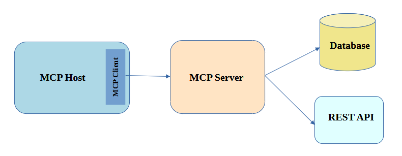

### MCP Components

  

The MCP Host is the AI-powered application that the end-user interacts with.
The MCP Client is a component residing within the MCP Host. It is responsible for calling the MCP Server.
The MCP Server is a separate program or service that provides specific capabilities, tools, or resources 
to the MCP Clients.
```
+----------------+       +----------------+       +----------------+
|    User        |       |    MCP Host    |       |    MCP Server  |
| (Interacts)    |-----> | (AI Application)|       | (Provides Tools|
+----------------+       | (Orchestrates) |       |  & Context)    |
         ^               |   |            |       |     ^          |
         |               |   | (Directs)  |       |     |          |
         |               |   v            |       |     | (Responds)|
         |               +----------------+       |     |          |
         |                     |                  |     |          |
         |               +----------------+       |     |          |
         |               |   MCP Client   |-------|----->+----------+
         |               | (Manages Conn.)|       | (Requests/Sends)
         |               +----------------+
         |                     ^
         |                     | (Receives)
         +---------------------+

```
